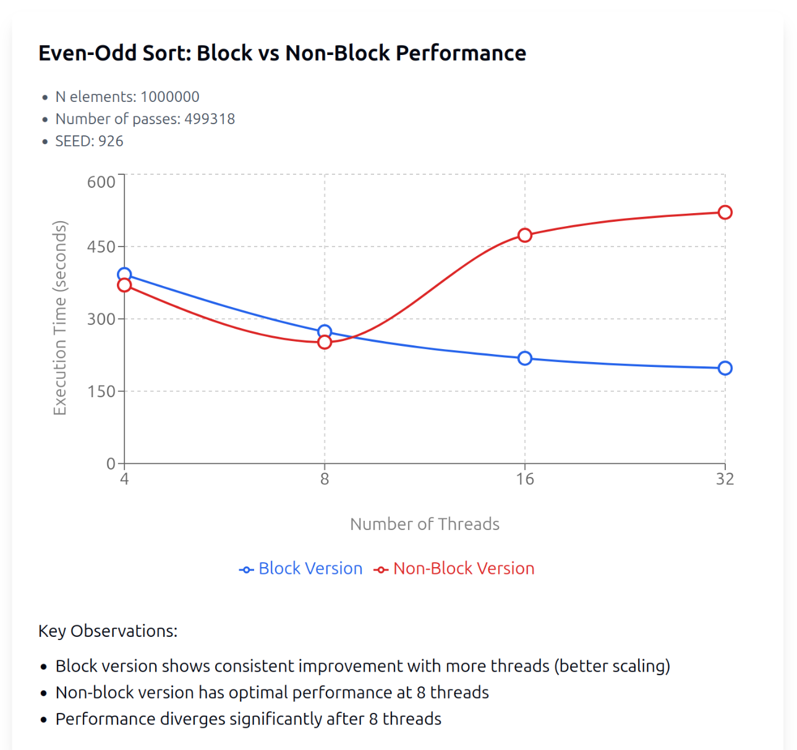

# Parallel Programming

This repository contains implementations of various parallel programming concepts.

## Technologies & Implementations

### 1. CUDA (GPU Programming)
- Matrix operations:
  - Matrix addition (`add_mat.cu`)
  - Matrix multiplication (`mul_mat.cu`) with both naive and tiled implementations
- Vector operations:
  - Dot product (`dotproduct.cu`)
  - Reduction operations (`dp_reduction.cu`)
- Memory management examples with host/device data transfers
- Optimization techniques:
  - Memory coalescing
  - Shared memory usage
  - Tiling for matrix operations

### 2. OpenMP
- Vector operations with parallel processing
- Basic thread management and parallel region examples
- Scheduling strategies:
  - Static scheduling
  - Dynamic scheduling
  - Guided scheduling
- Critical sections and reduction operations

### 3. Pthreads
Various threading examples including:
- Basic thread creation and management
- Dining philosophers problem solutions:
  - With deadlock (`misleci-deadlock.c`)
  - Using trylock (`misleci-trylock.c`)
- Even-odd sort implementations:
  - Basic version (`sodo-liho-urejanje.c`)
  - Parallel version (`sodo-liho-urejanje-barrier.c`)
  - Block version (`sodo-lihi-blocno-v2.c`)

